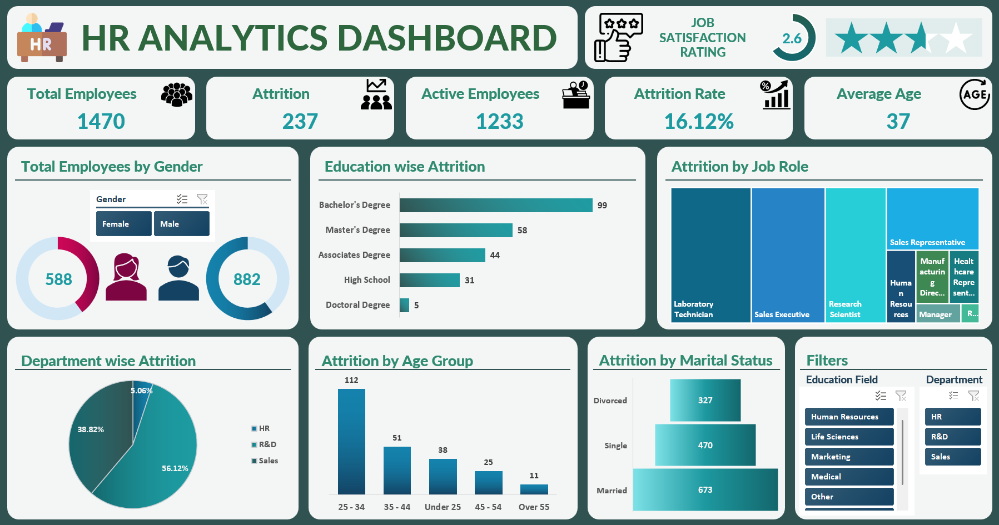

# HR Analytics Dashboard (Microsoft Excel)

## Overview

The **HR Analytics Dashboard** is a data analysis and visualization project created using **Microsoft Excel**. The goal of this project is to explore and analyze HR data in a simple, visual, and interactive way, helping users better understand workforce trends and employee attrition.

This dashboard transforms raw HR data into meaningful insights that can support better decision-making for human resources teams and business stakeholders.

---

## Why This Project?

Human resource data often contains valuable insights that are not immediately visible in raw tables. This project demonstrates how **Microsoft Excel** can be effectively used to:

* Analyze employee data
* Identify attrition patterns
* Compare workforce metrics across different categories
* Present insights in a clear and user-friendly dashboard

It also highlights Excel’s strength as a practical analytics tool for business and data analysis tasks.

---

## Dashboard Preview

Below is a snapshot of the HR Analytics Dashboard created in Excel:

The dashboard is designed to give a quick overview of key HR metrics while allowing users to explore the data through interactive elements.

---

## What the Dashboard Shows

The dashboard provides insights into:

### Key Metrics

* Total number of employees
* Active employees
* Attrition count and attrition rate
* Average employee age
* Job satisfaction rating

### Detailed Analysis

* Employee distribution by **gender**
* Attrition by **education level**
* Attrition by **job role**
* Attrition by **department**
* Attrition by **age group**
* Attrition by **marital status**

Interactive filters make it easy to focus on specific departments or education fields and explore the data dynamically.

---

## Tools Used

This project was built entirely using **Microsoft Excel**, making use of:

* Data cleaning and preparation techniques
* Pivot Tables for analysis and aggregation
* Charts and visual elements for clear data storytelling
* Slicers for interactivity and filtering

Excel is widely used in business analytics due to its flexibility, accessibility, and powerful built-in features.

---

## How to Use the Dashboard

1. Download the Excel file from this repository.
2. Open it using **Microsoft Excel** (Excel 2016 or newer is recommended).
3. Go to the dashboard sheet.
4. Use the slicers and filters to explore the data.
5. Review charts and KPIs to gain insights into employee attrition and workforce trends.

No additional tools or setup are required.

---

## Key Takeaways

This dashboard helps users:

* Understand which departments experience higher attrition
* Analyze how age, education, and job roles relate to employee turnover
* Gain a quick overview of workforce composition
* Practice using Excel for real-world data analysis and visualization
